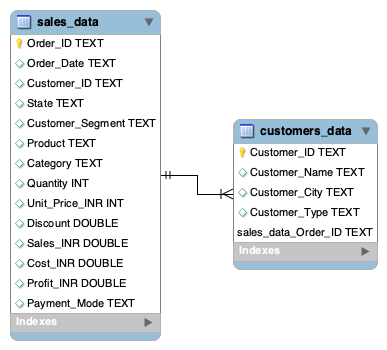

# Sales Data Analysis – SQL Project

## Project Overview

This project analyzes sales and customer data using MySQL to understand sales performance, profitability, product performance, regional trends, customer segments, and customer-level performance.

The project uses two tables:

- `sales_data` – sales and order information
- `customers_data` – customer details

The two tables are connected using `Customer_ID`.

---

## Business Objective

The main objectives of this project are:

- Analyze overall sales and profitability
- Compare sales and profit across states
- Analyze product performance
- Understand customer segment performance
- Analyze customer-level sales and profit
- Identify high-value customers
- Practice and apply different SQL JOINs
- Generate business insights from sales data

---

## Tools & Technologies

- MySQL
- SQL
- MySQL Workbench

---

## SQL Concepts Used

- SELECT
- WHERE
- Aggregate Functions
- GROUP BY
- HAVING
- ORDER BY
- LIMIT
- CASE WHEN
- Subqueries
- Window Functions
- INNER JOIN
- LEFT JOIN
- RIGHT JOIN
- FULL OUTER JOIN equivalent using UNION
- CROSS JOIN
- SELF JOIN
- COALESCE
- NULLIF

---

## Analysis Performed

### 1. Sales Performance Analysis

- Total orders
- Total sales
- Total quantity sold
- Average order value
- Highest and lowest sales orders

### 2. Profitability Analysis

- Total cost
- Total profit
- Overall profit margin
- Highest and lowest order-level profit

### 3. State-wise Analysis

- State-wise sales
- State-wise profit
- State-wise orders
- State-wise profit margin

### 4. Product Analysis

- Product-wise sales
- Product-wise profit
- Product-wise quantity sold
- Product-wise order count
- Product-wise profit margin

### 5. Customer Segment & Category Analysis

- Customer segment-wise sales
- Customer segment-wise profit
- Customer segment-wise orders
- Category-wise sales
- Category-wise profit
- Payment mode-wise orders

### 6. Customer & JOIN Analysis

- Customer details with orders
- Customer-wise total sales
- Customer-wise total profit
- Customers with no matching orders
- Customer-level sales summary
- Top customers by total profit

### 7. Advanced JOIN Analysis

Different SQL JOIN techniques were applied to combine and analyze customer and sales data:

- INNER JOIN
- LEFT JOIN
- RIGHT JOIN
- FULL OUTER JOIN equivalent
- CROSS JOIN
- SELF JOIN

---

## Key Business Insights

- Gujarat generated the highest total sales of ₹16,64,620.
- Gujarat generated the highest total profit of ₹2,63,975.17.
- Laptop was the most profitable product with total profit of ₹8,28,751.19.
- Small Business was the highest-sales customer segment with total sales of ₹53,69,040.
- Megha Malhotra was the top customer by total profit with profit of ₹1,03,059.89.

---

## Project Files

```text
Sales-SQL-Analysis/
│
├── sales_analysis.sql
├── sales_data.csv
├── customers_data.csv
└── README.md

## Data Model

The project uses two tables connected through Customer_ID.


